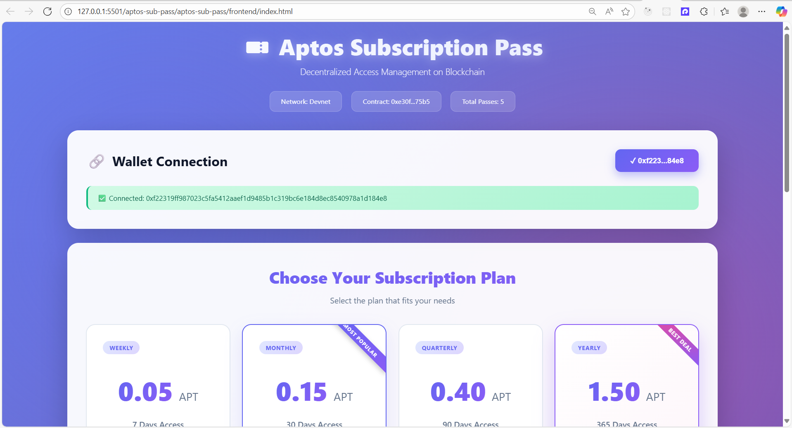
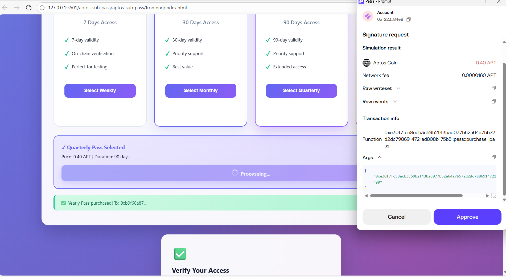
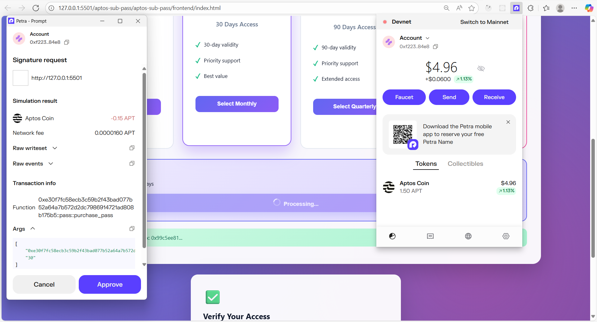
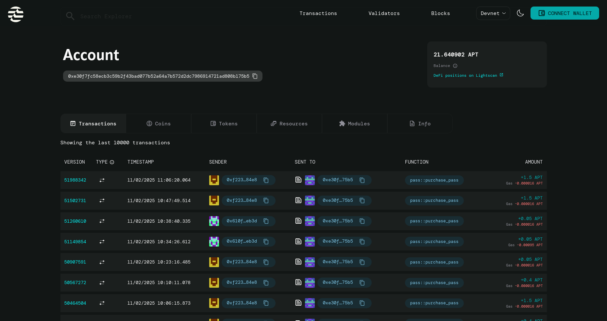
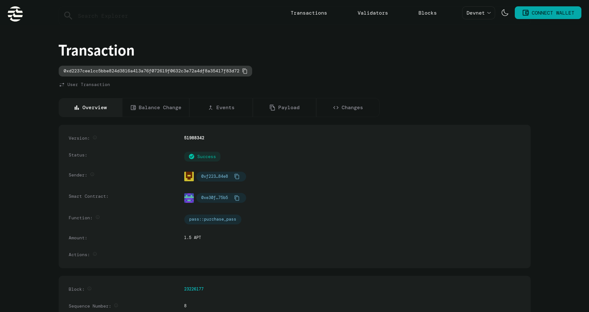

# Aptos Subscription Pass

A decentralized subscription management system built on the Aptos blockchain using the Move language.

## Overview

Aptos Subscription Pass allows users to purchase and manage time-based subscription passes using APT tokens. All subscription data is stored on-chain, ensuring transparency, immutability, and trustless verification.

## Project Structure

```
aptos-sub-pass/
├── sources/
│   └── subscription.move       # Main smart contract
├── frontend/
│   └── index.html             # Web interface
│
├── Move.toml                  # Move package configuration
└── .aptos/                    # Aptos account configuration
```

## Subscription Tiers

| Tier      | Duration | Price    | Description           |
| --------- | -------- | -------- | --------------------- |
| Weekly    | 7 days   | 0.05 APT | For short-term access |
| Monthly   | 30 days  | 0.15 APT | Regular users         |
| Quarterly | 90 days  | 0.40 APT | Extended access       |
| Yearly    | 365 days | 1.50 APT | Long-term savings     |

## Screenshots

**1. Dashboard**




**2. Payment**






---

# Contract Address

0xe30f7fc58ecb3c59b2f43bad077b52a64a7b572d2dc7986914721ad808b175b5






---

# Summary

A decentralized on-chain subscription management system built on Aptos, enabling users to purchase time-based passes using APT with transparent, verifiable tracking.
Includes smart contract, and a frontend for purchasing and validating subscriptions.

